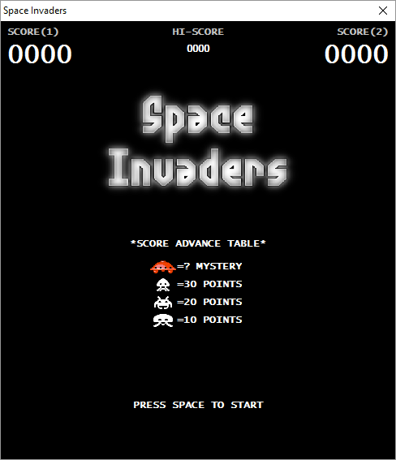
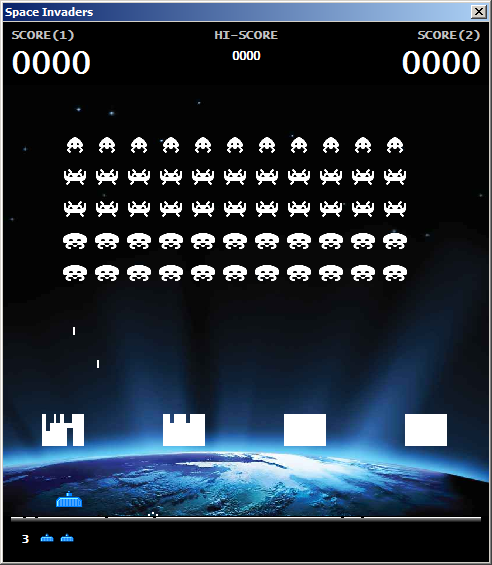
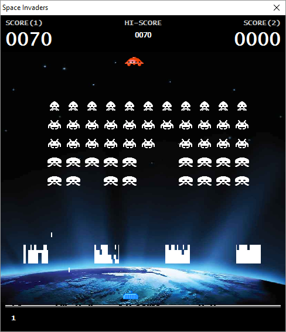

# Space Invaders for Delphi

A Delphi implementation of the classical arcade game [Space Invaders](https://en.wikipedia.org/wiki/Space_Invaders). Was ~~implemented~~ hacked in a 3 &#189; hours long hackathon, back in 2011. Then spent a week cleaning it up for better presentation.

### Screenshots

### Prerequisites

This game utilizes modules from [Graphics32](https://github.com/graphics32/graphics32), therefore you must have it installed into your Delphi development environment before attempting to run the game.

Also needed are the ubiquitous two projects  [JCL](https://github.com/project-jedi/jcl) and [JVCL](https://github.com/project-jedi/jvcl).

### Controls

Key | Usage
----|-----
<kbd>&larr;</kbd>, <kbd>&rarr;</kbd> | Move the tank to the left or to the right accordingly
<kbd>Space</kbd> | Launch a missile
<kbd>Pause</kbd> | Pause the game

## More work

There are still a lot of missing features, and bugs to be squashed. For the curious they can be found in the [TODO.md](TODO.md) file.

## License

Space Invaders for Delphi is released under the MIT license.
See [LICENSE](./LICENSE.md) for details.
